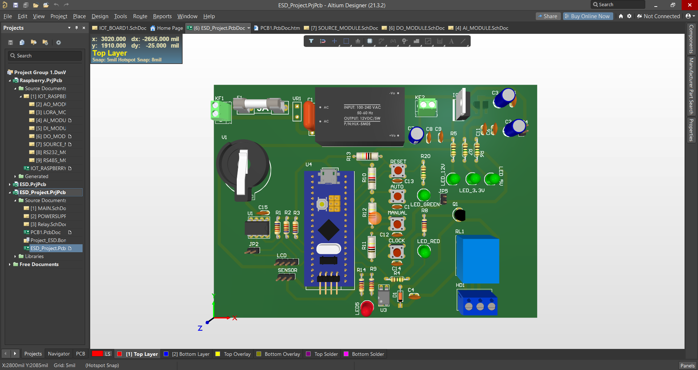

# PCB-layout-projects
These projects that I made when I studied how to use Altium.
The frontside of my first project.

The backside of my first project.

This is my first project and it is in a wired state with ground cover.

The frontside of the project.

The backside of the project.

This is an image of the project in a wired state with no ground cover, so the wires can be easily seen.

